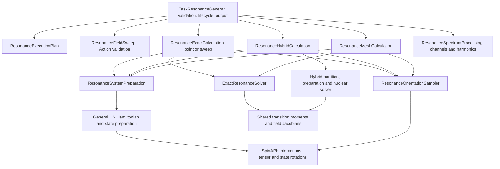

# General resonance task

`type=ResonanceGeneral` selects `RunSection/General/Resonance/TaskResonanceGeneral`.
It is a `BasicTask` that coordinates reusable General services. It does not
inherit from, instantiate, or call `TaskStaticHSResonanceSpectra`.

## Input compatibility

For a supported existing resonance input, change only the task selector:

```diff
- type=statichs-resonance-spectra;
+ type=ResonanceGeneral;
```

Keep the same `SpinSystem`, `Spin`, `Interaction`, `State`, `Properties`,
`Settings`, `Action`, and `Run/Task` blocks. Existing keyword spellings, units,
valid defaults, tensor imports, and output channel names are retained. No
`method`, `mode`, `backend`, propagation, or new nested configuration block is
required. `resonancegeneral`, `resonance-general`, and `Resonance-General` are
also accepted. The historical task selector remains available independently.

This task calculates static field-dependent resonance response. `Time` in the
output is the standard RunSection value; it is not a time-resolved EPR trace.
`HSGeneral`, `SSGeneral`, and `MultiSSGeneral` remain the propagation tasks.

## Architecture and ownership



The task holds a resolved plan and a spectrum cache per independent SpinSystem.
It writes one row per RunSection step, with each system occupying the columns
named in the header. A run starting again at step 1 clears and rebuilds caches.

`GeneralResonanceHamiltonian` delegates to `HSHamiltonianBuilder`, which delegates
matrix construction to SpinAPI with the full Hamiltonian approximation.
`HSStatePreparation` supplies initial-density construction and orientation
preparation; resonance opts into historical projector-weight normalization.
Its default behavior for the propagation tasks is unchanged. The density-only
orientation API avoids unnecessary density factorization during resonance work.

Magnetic moments, transition populations, line detection, field Jacobians,
Gaussian/Lorentzian kernels, exact eigenstate calculations, and hybrid nuclear
partitioning remain in reusable services. Mz blocking is an algebraic
acceleration applied only after testing that the Hamiltonian is block diagonal;
it is not a secular approximation. The hybrid route partitions the system before
constructing a full-system Hilbert space, preserving its nuclear scaling benefit.

## Main keywords and defaults

| Input | Meaning / default |
|---|---|
| `mwfrequency` (`frequency`) | Required positive finite frequency, GHz. |
| `linewidth` | Absorption FWHM, mT; default 0. |
| `lineshape` | `gaussian` (default) or `lorentzian`. |
| `solver` | `exact` (default) or explicit `hybrid`; `auto` is rejected. |
| `fieldinteraction` | Static Zeeman interaction whose field defines the scan; defaults to the first Zeeman interaction. |
| `detectspins` | Comma-separated detection spins; defaults to the selected Zeeman group. |
| `hamiltonianh0list` | Static interactions used for resonance energies; defaults to all static interactions. |
| `initialstate` | Optional task-level named State override, subject to frame restrictions below. |
| `fulltensorrotation` | `true`; preserves full tensor treatment through SpinAPI. `false` retains the historical tensor option. |
| `mzblocks` | `true`; use exact Mz blocks where available. |
| `enforce_zeeman_sync` | `false`; if true, temporarily synchronize selected Zeeman fields to the scan field and restore them afterward. |
| `sweepcache` | `true`; precompute a supported linear field sweep. |
| `sweepcachemode` | `exact`; see the modes below. |
| `harmonic` | 0 (absorption), 1 (first field derivative), or 2 (second derivative). |
| `modamp` | mT; default 0, selecting finite differences at the output field spacing. |

Interaction prefactors and units retain their SpinAPI definitions. Electron
Zeeman fields and `Action AddVector` increments are in **tesla**, while
`Field_mT`, linewidth, and modulation controls use **millitesla**. Microwave
frequency is in GHz and temperature in K. The internal Hamiltonian uses angular
frequency units of rad/ns. For example, a coupling tensor supplied in MHz uses
`commonprefactor=false; prefactor=0.006283185307179586;`. Do not apply that
conversion to an already converted interaction.

Additional accepted aliases are unchanged:

- `solver`: `resonancesolver`, `resonance_solver`.
- `sweepcache`: `cache_sweep`, `sweep_cache`.
- `sweepcachemode`: `sweep_cache_mode`, `cache_sweep_mode`.
- `enforce_zeeman_sync`: `enforcezeemansync`.
- `harmonic`: `detectionharmonic`, `detection_harmonic`.
- `modamp`: `modulationamplitude`, `modulation_amplitude`, `fieldmodulation`.

For compatibility, harmonic values outside 0–2 are clamped with a log message;
negative modulation amplitudes are reset to zero. Malformed physical inputs
should still be corrected rather than relying on these compatibility rules.

## States, populations and rotations

For exact calculations:

- `frame=fixed`: keep the prepared density fixed in laboratory coordinates.
- `frame=molecular`: rotate the density with the same crystallite rotation used
  for the Hamiltonian and magnetic moment operators. This is a physical state
  rotation, not an additional powder average.
- `initialstate=Thermal; frame=eigen; temperature=...; thermalhamiltonian=...;`
  in SpinSystem Properties: rebuild the Gibbs density for the selected thermal
  Hamiltonian at each orientation and field. This includes resonance fields in
  the refined-root calculation. A task-level State override is not accepted
  with this thermal mode.

The thermal Hamiltonian may deliberately be a subset of the resonance
Hamiltonian, except in `powdermesh`, which requires equality of the lists.
An empty exact thermal list retains SpinAPI's zero-Hamiltonian semantics; it
does not mean “all interactions.” List the full Hamiltonian for full equilibrium.

For historical resonance mixtures, weights multiply State projectors before
normalizing their sum to trace one. General propagation ordinarily normalizes
each component first. The shared preparation API makes this choice explicit;
migrating a resonance input does not reinterpret its existing weights.

Separate spin multiplets can remain separate input systems or runs. Their
populations are not automatically inferred from the task name, charge, or
multiplicity. Combining species requires specified population weights and a
common intensity convention; a sum of weighted component spectra is not a
convolution of the component spectra.

## Powder averaging

| Input | Meaning / default |
|---|---|
| `powdergridtype` | `sophe` by default; `fibonacci` selects the SpinAPI uniform sphere grid. |
| `powdergridsymmetry` | `auto`, using the historical Hamiltonian-tensor heuristic. |
| `powdergridsize` | SOPHE size; if not supplied, infer the nearest size from `powdersamplingpoints`, or use 19. |
| `powdersamplingpoints` | Uniform grid point count, or a target size for SOPHE. |
| `powdergammapoints` | 1; `powdergammastps` is the historical alias. |
| `powderfullsphere` | `true`; controls the uniform grid domain. SOPHE uses its symmetry domain. |

For a single orientation, explicitly use
`powdergridtype=fibonacci; powdersamplingpoints=1;`. Setting the point count to
one with the default SOPHE selection does not switch off SOPHE averaging.
The historical non-SOPHE selector uses the uniform grid; use the documented
`fibonacci` spelling to avoid relying on its fallback for unknown strings.

The resonance adapter preserves the historical passive ZYZ convention using
SpinAPI's rotation primitive. It also preserves the historical **raw powder
integral**, rather than the unit-normalized ensemble convention of General
propagation: SOPHE weights are multiplied by `2*pi/gammaPoints`; uniform-grid
weights by `1/gammaPoints`. A single uniform-grid orientation has weight one.
Do not compare absolute amplitudes from different grid conventions without
accounting for these measures.

The automatic SOPHE symmetry heuristic is carried over, not newly qualified
for arbitrary prepared-state anisotropy or every combination of rotated ZFS
and detection operators. For nonthermal anisotropic states or uncertain
symmetry, explicitly use `powdergridsymmetry=C1` and converge gamma sampling.
Converge the observable being reported, including its field derivative.

## Sweep modes

| Mode | Calculation and retained restrictions |
|---|---|
| `exact` (`direct`, `matrix`) | Full eigensystem at each sampled field and powder orientation; default. |
| `approx` (`approximate`, `crossing`, `resonance`) | Historical interpolated crossing scan and line broadening. It is an approximation. |
| `resonanceprojection` (`projection`, `projectedresfields`, `resfields`, `resfield`) | Coarse crossing scan; zero-width SOPHE inputs can use SpinAPI's angular projection mesh. |
| `refinedroots` | Locate roots with exact Hamiltonians and evaluate states/moments at resonance fields; requires a cached positive Gaussian width. |
| `powdermesh` | Experimental frequency-surface integration on angular/field cells, then Gaussian broadening; opt-in and restricted below. |

Projection scan density is controlled by `resfieldspoints`, with aliases
`resfields_points`, `sweepcachepoints`, and `sweep_cache_points`. If omitted,
the historical automatic scan-size rule applies.

Caching requires collinear, finite `Action AddVector` increments starting at
step 1, period 1, and covering the run. Multiple increments for the same target
are summed. Selected Zeeman fields must share the same initial field and
increment unless synchronization is explicitly enabled. Other physical
parameters cannot change during a cached sweep. Each independent SpinSystem
can have its own field action.

A cache that cannot represent an ordinary absorption scan falls back to
field-local exact evaluation. Refined roots, powder mesh, or requested
harmonics instead fail with an explanation if the needed sweep is unavailable.
Cached scans must stay on one side of zero. A derivative requires at least
three distinct output fields. Start cached runs at step 1; arbitrary mid-run
entry cannot reconstruct a missing precomputed derivative/root/mesh spectrum.

`harmonic=1/2` is the retained interpolated finite-difference operation on the
assembled field spectrum. With `modamp>0`, the half-span is `modamp/2`; otherwise
it is the mean output field spacing. Boundary interpolation clamps to endpoint
values. This is **not a full finite-amplitude lock-in modulation integral**.
The setting automatically enables caching, as in the historical task.

## Experimental powder mesh

Activation remains explicit:

```msd
sweepcache=true;
sweepcachemode=powdermesh;
meshcospoints=33;
meshphipoints=64;
meshfieldpoints=129;
meshfieldscale=0.25;
```

These are the defaults for mesh dimensions and field scale when the mode is
selected. `meshfieldscale` is in tesla; zero uses linear field planes and a
positive value uses an asinh field coordinate. `meshclusteraxes=false` by
default; when true, the cosine count must be odd and the azimuth count divisible
by four. `meshrawfile` optionally writes integrated transverse line weights
before broadening.

This mode requires the exact solver, a positive ascending laboratory z-field,
full tensor rotation, full-sphere sampling, one gamma point, a positive Gaussian
width, and full-Hamiltonian thermal equilibrium. Its own angular mesh replaces
the discrete powder grid for integration. It is not an extra mesh layered on
top of every SOPHE calculation, and it is not enabled for propagation tasks.

The migration preserves this experimental method; it does not certify every
mesh as converged. A very coarse mesh can miss narrow angular resonance regions
entirely. Converge the angular and field meshes independently for each model,
especially for narrow lines and higher-spin systems.

## Explicit hybrid solver

Keep the existing syntax:

```msd
solver=hybrid;
perturbativenuclei=N1,N2;
sweepcache=false;
harmonic=0;
```

Only listed nuclei receive perturbative treatment; unlisted nuclei remain in
the exact core. `hamiltonianh0list` must cover the complete static interaction
set exactly once. The partition builder validates ownership of all couplings
and the supported nuclear treatment; it does not silently omit interactions.

Supported populations are a single fixed State compatible with the partition,
or `Thermal; frame=eigen` with an explicit nonempty thermal Hamiltonian owned
entirely by the exact core. Perturbative nuclear populations remain maximally
mixed. Molecular-frame explicit states, cached hybrid sweeps, automatic solver
selection, and hybrid harmonics remain unsupported. A thermal Hamiltonian
including a coupling to a perturbative nucleus must not be relabeled as core
thermal equilibrium.

| Numerical control | Default |
|---|---|
| `hybridfieldstep` | `1e-4` T |
| `hybridminimumcorestateoverlap` | `0.90` |
| `hybridminimumnuclearstateoverlap` | `0.90` |
| `hybridjacobianreltol` | `1e-4` |
| `hybridjacobianabstol` | `1e-5` |
| `hybridoverlapthreshold` | `1e-14` |
| `hybridminimumcumulativeoverlapweight` | `0` |
| `hybridmaximumcomponentspercoretransition` | `0` (no component-count cap) |

The corresponding historical underscore aliases are accepted, as are
`hybridperturbativenuclei` and `hybrid_perturbative_nuclei`. Unsupported
partition, state-overlap, or field-Jacobian conditions fail explicitly.
Migration parity is not evidence that a perturbative approximation is adequate
for strong hyperfine coupling. Compare against an exact calculation in a
tractable representative system before relying on the hybrid approximation.

## Output, diagnostics and deliberate corrections

Every system contributes `Field_mT`, `Total_x`, `Total_y`, `Total_perp`,
`Cross_x`, `Cross_y`, then `_x`, `_y`, `_perp`, `_p`, `_m` for each detection
spin. Standard `Step`, `Time`, and requested standard-output columns precede
these. Cross terms retain interference between detection-spin moments.

The historical crossing diagnostics are retained through `debugpowder`,
`debugresonance`, `debugtrepr`, or `debugorientationdump`, together with
`debugfieldmin`, `debugfieldmax` (tesla), `debugmaxorientations`, and `debugfile`.
They record crossing/projection diagnostics, not an exhaustive dump for every
solver mode. The default path is the datafile plus `.orientation_debug.tsv`.
Use separate paths for separate diagnostic runs.

The new task deliberately rejects invalid microwave frequencies/line widths,
unknown line shapes or cache modes, invalid named field interactions, and
unknown/dynamic/duplicate explicitly selected Hamiltonian terms. Numerical
preparation failures in the exact sweep are reported instead of dropping an
orientation or field point silently. Multiple-system data now occupy one
complete row matching the header. These corrections affect invalid requests or
broken output behavior, not valid single-system input structure.

## Validation and examples

The maintained [task tests](../Tests/tests_ResonanceGeneral.cpp) compare every
output channel with the independent legacy task, test the
analytic isotropic line position/profile, and exercise General state rotations,
Zeeman restoration, restart behavior, and multiple-system output.

The [spin-½ X-band example](../Example/ResonanceGeneral/SpinHalf_X_band.msd)
uses a synthetic isotropic g = 2 electron at 20 K, with no hyperfine coupling.
It scans 320–360 mT at 9.5 GHz and writes an absorption line near 339.4 mT.
Set `harmonic=1` for its first field derivative. It needs no external data files.
From the repository root:

```bash
cmake -S . -B build-release -DCMAKE_BUILD_TYPE=Release
cmake --build build-release -j 2
OPENBLAS_NUM_THREADS=1 OMP_NUM_THREADS=1 ctest --test-dir build-release --output-on-failure
python3 Tests/check_general_resonance_architecture.py
OPENBLAS_NUM_THREADS=1 build-release/molspin -p 2 Example/ResonanceGeneral/SpinHalf_X_band.msd
```

The example writes `SpinHalf_X_band.dat` in the current working directory.
